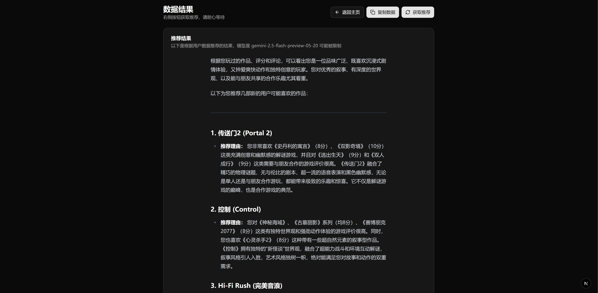

# Bangumi AI Recommender

总是不知道下一部动漫看什么，或者担心踩雷

利用大语言模型分析 Bangumi 用户的观影或游戏记录，智能推荐符合兴趣的新番或作品。  
AI-powered anime/game recommendation system based on Bangumi watch history.

在线体验：https://bangumi.ykrazy.top/

---

## ✨ 功能 Features

- 🔍 输入任意 Bangumi 用户名，获取其公开看过的动画/游戏数据
- 🤖 使用大语言模型分析用户喜好
- 🎯 推荐符合其口味的新作品
- 🌐 无需登录，界面清爽，开箱即用

---

## 🚀 技术栈 Tech Stack

- **前端**：Next.js + React + shadcn/ui
- **后端**：Bangumi 公共 API + LLM 接口（gemini-2.5-flash-preview-05-20）
- **推荐逻辑**：通过 prompt 工程引导大模型分析兴趣点

---

## 📦 快速开始 Quick Start

```bash
# 克隆仓库
git clone https://github.com/shenlye/bangumi-ai-recommender.git

# 安装依赖
pnpm install

# 启动开发环境
pnpm dev
```

配置环境变量
```
GEMINI_API_KEY=your_key_here
```

## 预览


